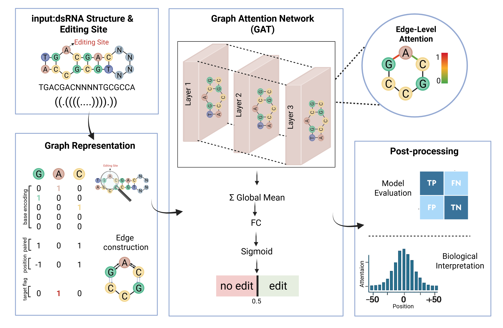
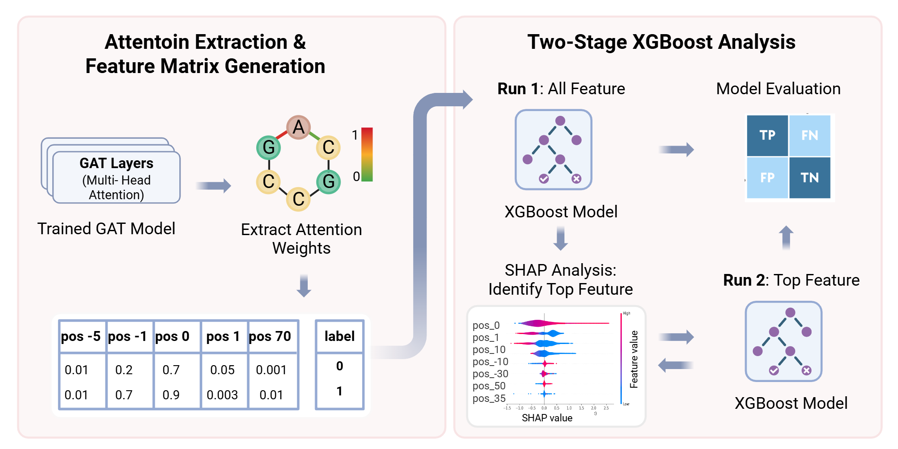

# AdarEdit: A Graph Foundation Model for Interpretable A-to-I RNA Editing Prediction

AdarEdit is a domain-specialized graph foundation model for predicting A-to-I RNA editing sites. Unlike generic foundation models that treat RNA as linear sequences, AdarEdit represents RNA segments as graphs where nucleotides are nodes connected by both sequential and base-pairing edges, enabling the model to learn biologically meaningful sequence–structure patterns.

## Key Features:
- Graph-based RNA representation: Captures both sequence and secondary structure information.
- High accuracy: F1 > 0.85 across cross-tissue evaluations (see Results).
- Cross-species generalization: Works on evolutionarily distant species even without Alu elements.
- Mechanistic interpretability: Graph attention highlights influential structural motifs.
- Foundation model behavior: A single model generalizes across tissues and conditions.



ADAREDIT model architecture showing RNA-to-graph conversion and Graph Attention Network processing


## Getting Started
### Requirments

First, clone this repository. 
```
git clone https://github.com/Scientific-Computing-Lab/AdarEdit.git
cd AdarEdit
```

You may use the file  `environment.yml` to create anaconda environment with the required packages.

### Steps to Use the environment.yml File:
#### Create the Environment:
1. Save the `environment.yml` file in your project directory, then run the following command:
   
```
conda env create -f environment.yml
```

2. Activate the Environment:
   
```
conda activate rnagnn
```

## Data Processing Pipeline
### Step 1a: Human Alu Dataset Construction
The Scripts/Data_preparation/Classification_Data_Creation.py script creates classification datasets for each tissue:

Process:

- Read Alu pair regions from BED file (chr1,start1,end1,chr2,start2,end2,strand)
- Extract RNA sequences for each Alu pair using genome FASTA
- Connect Alu pairs with "NNNNNNNNNN" linker sequence
- Predict secondary structure using ViennaRNA fold_compound
- Extract editing levels from tissue-specific editing files
- Filter sites with >100 read coverage
- Generate full context sequences with structural annotations

Input:

`--pair_region`: BED file with Alu pair coordinates 
`--genome`: Human genome FASTA file
`--editing_site_plus/minus`: Editing level files 
`--editing_level`: Minimum editing threshold (e.g., 10.0)

Output:

data_for_prepare_classification.csv → data/data_for_model_input/tissues

```
for tissue in Brain_Cerebellum Artery_Tibial Liver Muscle_Skeletal; do
    python scripts/Classification_Data_Creation.py \
        --pair_region data/raw/alu_pairs.bed \
        --genome data/raw/hg38.fa \
        --editing_site_plus data/raw/${tissue}_editing_plus.tsv \
        --editing_site_minus data/raw/${tissue}_editing_minus.tsv \
        --editing_level 10.0 \
        --output_dir data/data_for_model_input/tissues
done
```

### Step 1b: Cross-Tissue Data Splitting
The Scripts/Data_preparation/build_cross_splits.R script creates balanced train/validation splits:
Process:

1. Load per-tissue CSV files from data/data_for_model_input/tissues/
2. Label editing sites: "yes" (≥10%) vs "no" (<1%)
3. Create balanced datasets (equal yes/no samples)
4. Generate all tissue-pair combinations for cross-validation
5. Remove training examples from validation sets to prevent data leakage

Input:

`--data_dir`: Per-tissue CSV files 
`--train_size`: Training samples per tissue (default: 19,200)
`--valid_size`: Validation samples per tissue (default: 4,800)
`--yes_cutoff`: Editing threshold for positive class (default: 10%)
`--no_cutoff`: Non-editing threshold for negative class (default: 1%)

Output:

Cross-tissue directories → data/data_for_model_input/tissues/cross_splits/{train_tissue}/{train_tissue}_{valid_tissue}/
Training files: {train_tissue}_train.csv
Validation files: {valid_tissue}_valid.csv
Summary report: cross_split_summary.csv

```
Rscript scripts/build_cross_splits.R \
    --data_dir data/data_for_model_input/tissues/ \
    --output_dir data/data_for_model_input/tissues/cross_splits/ \
    --train_size 19200 \
    --valid_size 4800 \
    --yes_cutoff 10 \
    --no_cutoff 1 \
    --seed 42
```

### Step 2: Cross-Species Dataset Construction (Non-Alu)
Cross-species datasets are constructed using a multi-step pipeline that processes editing sites from three evolutionarily distant species lacking Alu elements:
Target Species:

* Strongylocentrotus purpuratus (Sea urchin) - Echinoderm
* Ptychodera flava (Acorn worm) - Hemichordate
* Octopus bimaculoides (Octopus) - Mollusk

#### Pipeline Overview:
The cross-species data construction follows a 6-step pipeline that processes raw editing sites into training-ready datasets:

Key Processing Steps:

1. Editing Level Extraction: Parse sequencing data to calculate A-to-I editing ratios
2. Spatial Clustering: Merge editing sites within 1kb distance, retain clusters with >5 sites
3. Density Selection: Extract sequence regions with highest editing site density
4. Structure Prediction: Predict RNA secondary structure using RNAfold
5. Quality Filtering: Apply coverage (≥100 reads) and editing level (≥10%) thresholds
6. Dataset Preparation: Create balanced train/validation splits with equal edited/non-edited sites
   
Step-by-step Pipeline:


## Model Training and Evaluation
### Model Architecture
ADAREDIT employs a Graph Attention Network (GAT) architecture with the following components:

Graph Representation: RNA segments as graphs with nucleotides as nodes
Edge Types: Sequential (adjacent nucleotides) and structural (base-pairs)
Node Features: 8-dimensional vectors including base encoding, pairing status, relative position, and target flag
Architecture: 3-layer GAT with multi-head attention (4 heads per layer)
Output: Binary classification with attention weights for interpretability

Training a Model
Basic Training Command:

```
python Scripts/model/gnnadar_verb_compact.py \
    --train_file {tissue}_train.csv \
    --val_file {tissue}_valid.csv \
    --epochs 1000 \
    --mode train \
    --batch_size 128 \
    --num_workers 6 \
    --checkpoint_dir checkpoints/Liver \
    --checkpoint_interval 10
```
Training Parameters:

`--train_file`: Path to training CSV file
`--val_file`: Path to validation CSV file
`--epochs`: Number of training epochs (default: 600)
`--batch_size`: Training batch size (default: 128)
`--mode`: Operation mode ('train' or 'eval')
`--checkpoint_dir`: Directory to save model checkpoints
`--checkpoint_interval`: Epoch interval for saving checkpoints (default: 10)

Model Evaluation
Evaluate Pre-trained Model:

```
python Scripts/model/gnnadar_verb_compact.py \
    --val_file {{tissue}_valid.csv \
    --mode eval \
    --checkpoint checkpoints/{tissue}/model_checkpoint_epoch_980.pth
```

## Results

### Best Model Checkpoints
The training script automatically identifies and saves the top 10 performing models based on a composite performance score (accuracy + F1 + sensitivity + specificity + precision). After training, you can find:

- *Top model rankings:* ;`top_epochs.csv` - Lists the 10 best epochs with their performance metrics
- *Best model checkpoint directory*: /checkpoints/ - Contains all saved model checkpoints
- *Validation logs*: `validation_logs.csv` - Complete training history with metrics per epoch

Example structure:
```
results/
├── Liver/
│   ├── checkpoints/
│   │   ├── model_checkpoint_epoch_980.pth  # Top performing model
│   │   ├── model_checkpoint_epoch_970.pth
│   │   └── ...
│   ├── top_epochs.csv                      # Top 10 models ranking
│   └── validation_logs.csv                 # Training history
```
### Cross-Tissue and Cross-Species Performance


(A) Cross-tissue evaluation showing model performance across different tissue combinations. (B) Cross-species evaluation demonstrating generalization capability

All trained model checkpoints from our comprehensive cross-tissue and species evaluation are available in the trained_models/ directory. This includes the best performing models for each train-validation tissue combination. 

## Model Interpretability
AdarEdit provides comprehensive interpretability analysis through two complementary approaches:

### 1. XGBoost-based Feature Analysis
The interpretability pipeline (Scripts/interpretability/xgboost_shap_analysis.py) performs two-stage XGBoost analysis:
Usage:
```
python Scripts/interpretability/xgboost_shap_analysis.py \
    --attention_csv attention_data.csv
```
#### Process:



* Stage 1: Train XGBoost on all attention features (positions -600 to +600)
* Stage 2: Apply SHAP analysis to identify top 20 most important features
* Stage 3: Retrain XGBoost using only top 20 features

Outputs:

- `shap_top20_XGBoost.png`: SHAP feature importance plot for full model
- `shap_top20_Retrained_XGBoost.png`: SHAP plot for retrained model
- `shap_data_Original_Model.pkl`: Saved SHAP analysis data
- `shap_data_Retrained_Model.pkl`: Saved retrained model SHAP data

### 2. Graph Attention Analysis
The GNN model automatically generates attention analysis during evaluation:
Generated during model evaluation:

- `attention_data.csv`: Attention weights for each position (-650 to +649) for each validation sample
- `attention_graphs/`: Directory containing detailed attention visualization plots


