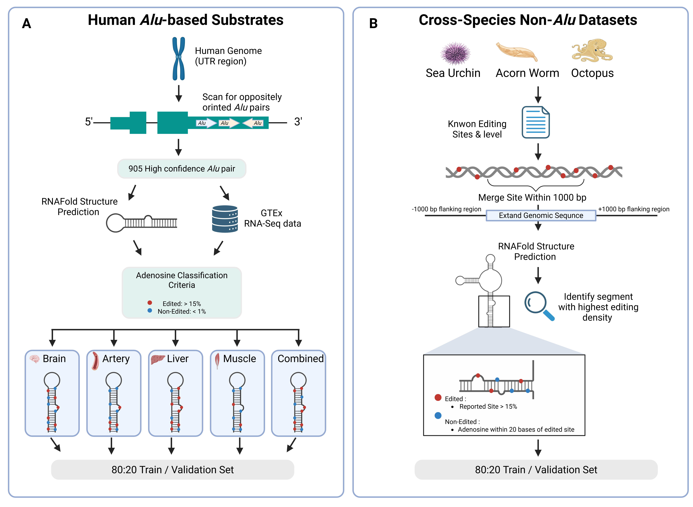
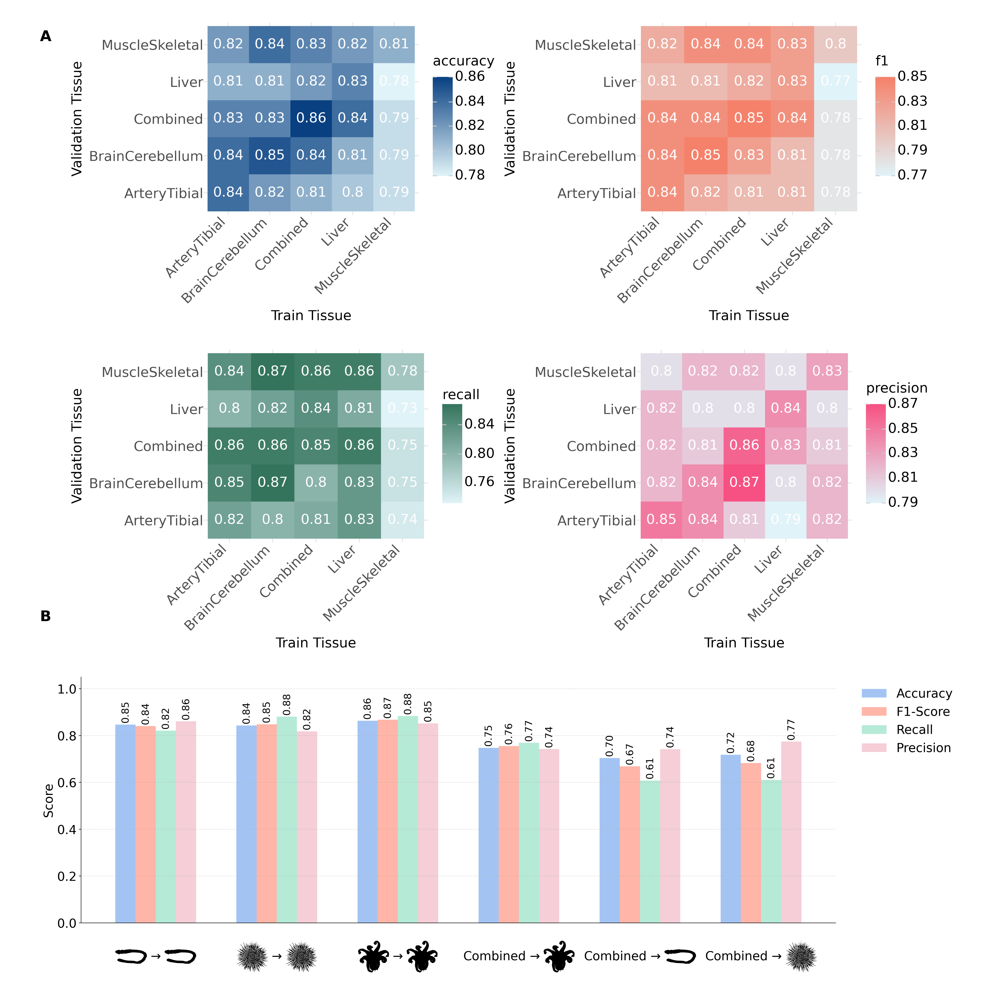

# AdarEdit: A Graph Foundation Model for Interpretable A-to-I RNA Editing Prediction

AdarEdit is a domain-specialized graph foundation model for predicting A-to-I RNA editing sites. Unlike generic foundation models that treat RNA as linear sequences, AdarEdit represents RNA segments as graphs where nucleotides are nodes connected by both sequential and base-pairing edges, enabling the model to learn biologically meaningful sequence–structure patterns.

## Key Features:
- Dual architecture: Baseline (data-driven) and bio-aware (biochemically-informed) models
- Graph-based RNA representation: Captures both sequence and secondary structure information.
- High accuracy: F1 ≈ 0.90 (bio-aware), AUROC/AUPRC ≈ 0.96 (combined tissue).
- Cross-species generalization: Works on evolutionarily distant species even without Alu elements.
- Mechanistic interpretability: Graph attention highlights influential structural motifs.
- Foundation model behavior: A single model generalizes across tissues and conditions.


## Model Architectures

**Baseline Model:**

Node features (8-dim): Base identity, pairing status, relative position, target flag
Edges: Sequential + base-pairing (uniform)

**Bio-aware Model:**

Node features (22-dim): Baseline + trinucleotide context, stem-loop geometry, pairing energies
Edges: Typed (canonical/wobble/sequential) with learned embeddings
Additional: Parallel 1D CNN (3-mer/5-mer filters), optional global attention


AdarEdit model architecture showing RNA-to-graph conversion and Graph Attention Network processing


## Getting Started
### Requirements

First, clone this repository. 

You may use the file  `environment.yml` to create anaconda environment with the required packages.

### Steps to Use the environment.yml File:
#### Create the Environment:
1. Save the `environment.yml` file in your project directory, then run the following command:
   
```
conda env create -f environment.yml
```

2. Activate the Environment:
   
```
conda activate rnagnn
```

## Data Processing Pipeline


### Step 1a: Human Alu Dataset Construction
The Script/Human_Alu/Data_preparation/Classification_Data_Creation.py script creates classification datasets for each tissue:

Process:

- Read Alu pair regions from BED file (chr1,start1,end1,chr2,start2,end2,strand)
- Extract RNA sequences for each Alu pair using genome FASTA
- Connect Alu pairs with "NNNNNNNNNN" linker sequence
- Predict secondary structure using ViennaRNA fold_compound
- Extract editing levels from tissue-specific editing files
- Filter sites with >100 read coverage
- Generate full context sequences with structural annotations

Input:

`--pair_region`: BED file with Alu pair coordinates 
`--genome`: Human genome FASTA file
`--editing_site_plus/minus`: Editing level files 
`--editing_level`: Minimum editing threshold (e.g., 10.0)

Output:

data_for_prepare_classification.csv

```
for tissue in Brain_Cerebellum Artery_Tibial Liver Muscle_Skeletal; do
    python Script/Human_Alu/Data_preparation/Classification_Data_Creation.py \
        --pair_region data/raw/alu_pairs.bed \
        --genome data/raw/hg38.fa \
        --editing_site_plus data/raw/${tissue}_editing_plus.tsv \
        --editing_site_minus data/raw/${tissue}_editing_minus.tsv \
        --editing_level 10.0 \
        --output_dir data/data_for_model_input/tissues
done
```

### Step 1b: Cross-Tissue Data Splitting
The Script/Human_Alu/Data_Preparation/build_cross_splits.R script creates balanced train/validation splits:
Process:

1. Load per-tissue CSV files from data/data_for_model_input/tissues/
2. Label editing sites: "yes" (≥15%) vs "no" (<1%)
3. Create balanced datasets (equal yes/no samples)
4. Generate all tissue-pair combinations for cross-validation
5. Remove training examples from validation sets to prevent data leakage

Input:

`--data_dir`: Per-tissue CSV files 
`--train_size`: Training samples per tissue (default: 19,200)
`--valid_size`: Validation samples per tissue (default: 4,800)
`--yes_cutoff`: Editing threshold for positive class (default: 10%)
`--no_cutoff`: Non-editing threshold for negative class (default: 1%)

Output:

Cross-tissue directories - 
Training files: {train_tissue}_train.csv
Validation files: {valid_tissue}_valid.csv
Summary report: cross_split_summary.csv

```
Rscript Script/Human_Alu/Data_Preparation/build_cross_splits.R \
    --data_dir data/data_for_model_input/tissues/ \
    --output_dir data/data_for_model_input/tissues/cross_splits/ \
    --train_size 19200 \
    --valid_size 4800 \
    --yes_cutoff 10 \
    --no_cutoff 1 \
    --seed 42
```

### Step 2: Cross-Species Dataset Construction (Non-Alu)
Cross-species datasets are constructed using a multi-step pipeline that processes editing sites from three evolutionarily distant species lacking Alu elements:
Target Species:

* Strongylocentrotus purpuratus (Sea urchin) - Echinoderm
* Ptychodera flava (Acorn worm) - Hemichordate
* Octopus bimaculoides (Octopus) - Mollusk

#### Pipeline Overview:
The cross-species data construction follows a 6-step pipeline that processes raw editing sites into training-ready datasets:

Key Processing Steps:

1. Editing Level Extraction: Parse sequencing data to calculate A-to-I editing ratios
2. Spatial Clustering: Merge editing sites within 1kb distance, retain clusters with >5 sites
3. Density Selection: Extract sequence regions with highest editing site density
4. Structure Prediction: Predict RNA secondary structure using RNAfold
5. Quality Filtering: Apply coverage (≥100 reads) and editing level (≥10%) thresholds
6. Dataset Preparation: Create balanced train/validation splits with equal edited/non-edited sites
   
Step-by-step Pipeline:

#### 0) Environment & Dependencies

All scripts live under: Script/Evolution/

Conda environment

Use the provided environment file:

```
conda env create -f Script/Evolution/environment_evolution.yml
conda activate evolution
```
This environment includes (or expects) the following:
- Python ≥ 3.10, pandas, pyfaidx
- ViennaRNA (with Python bindings; RNA / ViennaRNA)
- bedtools
- R + packages: data.table, dplyr, readr, tidyr, optparse, stringr, tools
- RNAstructure CLI tools: dot2ct, draw (on PATH)
- bpRNA (bpRNA.pl accessible; see below)

##### RNAstructure data tables (DATAPATH)

The scripts will try to auto-detect DATAPATH (e.g., $CONDA_PREFIX/share/rnastructure/data_tables). If needed, set it explicitly:
```
export DATAPATH="$CONDA_PREFIX/share/rnastructure/data_tables"
```
##### bpRNA installation

Install bpRNA from GitHub and make the Perl entrypoint reachable in your environment:
```
git clone https://github.com/hendrixlab/bpRNA.git
# Option A: symlink into the active conda env
ln -sf "$(pwd)/bpRNA/bpRNA.pl" "$CONDA_PREFIX/bin/bpRNA.pl"
chmod +x "$CONDA_PREFIX/bin/bpRNA.pl"

# Option B: set env var instead of symlink
export BPRNA_PL="$(pwd)/bpRNA/bpRNA.pl"
```
The pipeline requires either bpRNA.pl on PATH or BPRNA_PL set.

#### 1) Inputs per species

For each species prepare:
- **Genome FASTA** (index will be created by `pyfaidx` on first use).  
  *Use the same reference genome/version reported in Zhang et al., Cell Reports (2023), Supplemental Information.*
- **Editing results table** (“resTable”-like; includes base counts per replicate, strand, etc.).  
  *Use the per-species editing tables provided in Zhang et al., Cell Reports (2023), Supplemental Information.*
- **Output directory** for intermediate and final files.

#### 2) End-to-end pipeline
Below, replace Species and all paths accordingly (run for each species).

## Step 1 — Parse editing table → CSV + BED6

Script: Script/Evolution/get_editing_levels.py

- Keeps A→G only
- Aggregates replicate counts
- Computes EditingLevel and Total_Coverage

Writes:
- A2IEditingSite.csv
- A2IEditingSite.bed (BED6 with strand)

```
  python Script/Evolution/get_editing_levels.py \
  -i /path/to/Species.resTable.txt \
  -d /path/to/Species/
```
Optional flags (see --help): minimum coverage filter, custom column names, etc.

## Step 2 — Cluster nearby editing sites (strand-aware)

Script: Script/Evolution/cluster_editing_sites.py

Wraps:
```
bedtools sort -i A2IEditingSite.bed \
| bedtools merge -d 1000 -s -c 3,3,6 -o count,collapse,distinct
```
Keeps clusters with site count > 5.
```
python Script/Evolution/cluster_editing_sites.py \
  -i /path/to/Species/A2IEditingSite.bed \
  -d 1000 \
  -m 5 \
  -D /path/to/Species/
```
Output: /path/to/Species/cluster_d1000_up5editingsite.bed

## Step 3 — Fold windows, choose dsRNA segment with majority of ES; annotate sites & nearby A

Script: Script/Evolution/get_ds_with_majority_ES.py

- Extracts/folds extended windows (ViennaRNA)
- Converts and draws structures (dot2ct, draw)
- Runs bpRNA to parse segments (.st)
- Selects the segment containing the majority of editing sites
- Intersects the chosen ds regions with all editing sites (BED6)
- Collects nearby A (≤20 nt from an edited site) as negatives
- Writes structure SVGs and summary CSVs

```
python Script/Evolution/get_ds_with_majority_ES.py \
  -i /path/to/Species/cluster_d1000_up5editingsite.bed \
  -o /path/to/Species/ \
  -e /path/to/Species/A2IEditingSite.bed \
  -g /path/to/Species/genome.fa \
  --num_processes 8
```
Key outputs (in -o):
- all_data_results.csv — ds selection, coordinates, MFE, etc.
- mfe_data_results.csv — per-window MFE summary
- Per-region .dbn/.ct/.shape/.svg

## Step 4 — Merge structure results with per-site editing levels

Script: Script/Evolution/merge_ds_results.py

- Expands by relative_positions (edited) and A_20d (nearby adenosines)
- Joins editing metrics by (Chr, Position, Strand)
- Writes combined table
  
```
python Script/Evolution/merge_ds_results.py \
  -e /path/to/Species/A2IEditingSite.csv \
  -a /path/to/Species/all_data_results.csv \
  -o /path/to/Species/dsRNA_structure_with_editing_sites_andA20.csv \
  -w 15
```

## Step 5 — De-duplicate groups & filter by length / coverage (and optional editing threshold)

Script: `Script/Evolution/filter_ds_groups.R`

- Collapses to one row per (Chr, Position, Strand) using boundary consistency (default tolerance 20 bp for each ds boundary)
- Keeps length_small_ds ≥ 200 and Total_Coverage ≥ 100
- Optionally saves rows above an editing threshold (default 0.1)

```
Rscript Script/Evolution/filter_ds_groups.R \
  --input  /path/to/Species/dsRNA_structure_with_editing_sites_andA20.csv \
  --output /path/to/Species/dsRNA_structure_with_editing_sites_andA20_len200_cov_100_withoutDup.csv \
  --tolerance 20 --min-length 200 --min-coverage 100 \
  --editing-threshold 0.1
# optionally:
# --save-above-threshold /path/to/Species/above_0.1.csv
```

## Step 6 — Prepare balanced ML train/valid sets per species

Script: Script/Evolution/prepare_balanced_ml_sets.R (comma-list interface)

- Splits small_ds_seq into L/R by Local_Position
- Labels yes if EditingLevel > 0.1, no if < 0.001 (configurable)
- Balances yes/no per species and (optionally) equalizes across species
- Splits 80/20 → train/valid (configurable)
  
```
Rscript Script/Evolution/prepare_balanced_ml_sets.R \
  --inputs "Strongylocentrotus_purpuratus=/.../Strongylocentrotus_purpuratus/..._withoutDup.csv,Octopus_bimaculoides=/.../Octopus_bimaculoides/..._withoutDup.csv,Ptychodera_flava=/.../Ptychodera_flava/..._withoutDup.csv" \
  --out-dir /path/to/all_data/ \
  --pos-threshold 0.1 --neg-threshold 0.001 \
  --train-frac 0.8 --equalize-across TRUE --seed 42
```
Outputs (per species under --out-dir/<Species>/):
- `data_for_prepare_<Species>.csv`
- `final_<Species>_train.csv`
- `final_<Species>_valid.csv`

These are the files you feed into AdarEdit’s training/evaluation scripts (see your model README section).

**Examples.** See `data_evo/examples/Evolution/` — it contains all example inputs/outputs you need (except the species editing site and genome FASTA, which is not included due to its size). For the clustering demo we kept only the first **40** clusters from `cluster_d1000_up5editingsite.bed`. 

## Data Format Conversion

The final data preparation step converts CSV files to JSONL format required by the models.

### Script: `Script/Human_Alu/Data_Preparationcsv_to_jsonl.py`

**Converts CSV files (output from data processing pipeline) to JSONL format (input for model training).**

### Usage

```bash
# Convert all CSV files in a directory tree
python csv_to_jsonl.py datasets/

# Convert CSV files in current directory
python csv_to_jsonl.py .

# Convert specific directory
python csv_to_jsonl.py datasets/Liver/combine_3_2/
```

### Input Format (CSV)

From the data processing pipeline, each CSV has 4 columns:

```csv
structure,L,R,y_n
(((...)))...(((...))),AUGCUAGCUAGC,GCUAGCUAGCUA,yes
.((..))....((..)),CUAGCUAGCUAG,UAGCUAGCUAGC,no
...
```

**Columns:**
- `structure`: Dot-bracket notation of RNA secondary structure
- `L`: Left flanking sequence (upstream of editing site)
- `R`: Right flanking sequence (downstream of editing site)
- `y_n`: Label - "yes" (edited) or "no" (non-edited)

### Output Format (JSONL)

Each CSV row becomes a JSONL entry:

```json
{"messages": [{"role": "system", "content": "Predict if the central adenosine (A) in the given RNA sequence context within an Alu element will be edited to inosine (I) by ADAR enzymes."}, {"role": "user", "content": "L:AUGCUAGCUAGC, A:A, R:GCUAGCUAGCUA, Alu Vienna Structure:(((...)))...(((...))"}, {"role": "assistant", "content": "yes"}]}
{"messages": [{"role": "system", "content": "Predict if the central adenosine (A) in the given RNA sequence context within an Alu element will be edited to inosine (I) by ADAR enzymes."}, {"role": "user", "content": "L:CUAGCUAGCUAG, A:A, R:UAGCUAGCUAGC, Alu Vienna Structure:.((..))....((..)"}, {"role": "assistant", "content": "no"}]}
```


## Model Training and Evaluation

Use the automated runner script to train and evaluate both models across all tissue combinations:

### Script: `Scripts/model/run_all_evals_bioaware_baseline.py`

**What it does:**
1. Creates a timestamped workspace copy of the project and datasets
2. Runs smoke test to verify imports and paths
3. Trains and evaluates both models on all train/valid pairs in `datasets/**/combine_*/`
4. Saves checkpoints, predictions, and ROC/PR curves for each model and split
5. Generates a comprehensive evaluation summary


### Basic Usage

```bash
python run_all_evals_bioaware_baseline.py \
    --variants baseline,bioaware
```

his will:
- Train baseline and bio-aware models on all tissue combinations
- Save results to `overnight_eval_YYYYMMDD_HHMMSS/`
- Run 1000 epochs per model/split
- Use batch size 256

### Advanced Options

```bash
python run_all_evals_bioaware_baseline.py \
    --variants baseline,bioaware          # Models to train (comma-separated)
    --timestamp my_experiment_name        # Custom workspace name (optional)
    --resume_existing                     # Skip splits with existing predictions
    --start_after "combine_2_4/Liver->Brain"  # Resume from specific split
    --skip_variants baseline              # Skip specific models
    --clean_variants bioaware             # Delete old results for specific models
```

**Available variants:**
- `baseline`: Baseline GAT model
- `bioaware`: Bio-aware model with typed edges + sequence CNN

## Input Data Structure

The script expects datasets organized as:

```
datasets/
├── Liver/
│   ├── combine_3_2/
│   │   ├── Liver_train.jsonl
│   │   ├── Liver_valid.jsonl
│   └── combine_3_1/
│       └── ...
├── Brain_Cerebellum/
│   └── combine_4_2/
│       └── ...
└── Combined/
    └── ...
```

## Output Structure

After running, you'll find in `overnight_eval_YYYYMMDD_HHMMSS/`:

```
overnight_eval_20240128_153045/
├── checkpoints/
│   ├── Liver/
│   │   ├── baseline/
│   │   │   └── combine_3_2_Liver_Liver/
│   │   │       └── best.pth              # Best checkpoint for this split
│   │   └── bioaware/
│   │       └── combine_3_2_Liver_Liver/
│   │           └── best.pth
│   └── Brain_Cerebellum/
│       └── ...
├── predictions/
│   ├── Liver/
│   │   ├── baseline/
│   │   │   ├── combine_3_2_Liver_Liver.jsonl         # Per-sample predictions
│   │   │   └── combine_3_2_Liver_Liver/
│   │   │       └── curves.npz                        # ROC/PR curve data
│   │   └── bioaware/
│   │       └── ...
│   └── ...
└── comprehensive_evaluation.md                        # Summary table
```

## Model Selection

Both models use **F1-optimized threshold search**:
- At each epoch, evaluate on validation set
- Test 33 thresholds (0.1 to 0.9)
- Select threshold that maximizes F1 score
- Save checkpoint if F1 improves
- Best checkpoint is automatically selected

**This ensures optimal performance for each tissue and split.**

## Individual Model Training (Alternative)

If you prefer to train models individually, use the standalone scripts:

### Baseline
```
python Scripts/model/gnnadar_verb_compact.py \
    --train_file {tissue}_train.csv \
    --val_file {tissue}_valid.csv \
    --epochs 1000 \
    --mode train \
    --batch_size 128 \
    --num_workers 6 \
    --checkpoint_dir checkpoints/Liver \
    --checkpoint_interval 10
```

### Cross-Tissue and Cross-Species Performance



- **(A, B)** ROC and PR curves comparing AdarEdit (graph-based) with sequence-only baselines (EditPredict, RNA-FM, ADAR-GPT) on liver tissue. Graph-based models achieve higher AUROC and AUPRC.
- **(C, D)** Cross-tissue F1 heatmaps for baseline and bio-aware models. Rows = training tissue, columns = validation tissue. Diagonal = within-tissue performance; off-diagonal = cross-tissue generalization.
- **(E)** ΔF1 heatmap showing bio-aware improvement over baseline across all tissue combinations.
- **(F)** Cross-species F1 scores: within-species (species→species) and human-to-other transfer (Combined→species) for sea urchin, acorn worm, and octopus.
- **(G, H)** ROC and PR curves for all cross-tissue and cross-species combinations, comparing baseline and bio-aware models.

**Key findings:** Bio-aware model outperforms baseline in 20/25 tissue settings (ΔF1 = +0.012 average) and shows robust cross-species transfer.

## Model Interpretability
AdarEdit provides comprehensive interpretability analysis through two complementary approaches:

### 1. XGBoost-based Feature Analysis
The interpretability pipeline (Scripts/interpretability/xgboost_shap_analysis.py) performs two-stage XGBoost analysis:
Usage:
```
python Scripts/interpretability/xgboost_shap_analysis.py \
    --attention_csv attention_data.csv
```
#### Process:


* Stage 1: Train XGBoost on all attention features (positions -600 to +600)
* Stage 2: Apply SHAP analysis to identify top 20 most important features
* Stage 3: Retrain XGBoost using only top 20 features

Outputs:

- `shap_top20_XGBoost.png`: SHAP feature importance plot for full model
- `shap_top20_Retrained_XGBoost.png`: SHAP plot for retrained model
- `shap_data_Original_Model.pkl`: Saved SHAP analysis data
- `shap_data_Retrained_Model.pkl`: Saved retrained model SHAP data

### 2. Graph Attention Analysis
The GNN model automatically generates attention analysis during evaluation:
Generated during model evaluation:

- `attention_data.csv`: Attention weights for each position (-650 to +649) for each validation sample
- `attention_graphs/`: Directory containing detailed attention visualization plots


